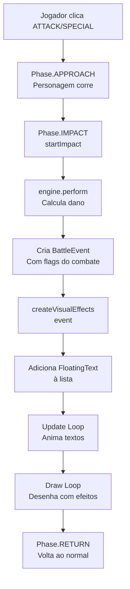

# Guia Rápido - Sistema de Efeitos Visuais

## 🎯 Resumo em 1 Minuto

O sistema usa **eventos** para comunicar o que aconteceu no combate (crítico, esquiva, etc.) do **engine** para a **view**, que então cria **textos flutuantes** animados.

---

## 📊 Arquitetura Simplificada

```
┌────────────────────┐
│  UiBattleEngine    │  ← Motor de combate
│  - Calcula dano    │
│  - Cria BattleEvent│
└─────────┬──────────┘
          │ event
          ▼
┌────────────────────┐
│ PixelBattleView    │  ← Visualização
│ - Recebe event     │
│ - Cria FloatingText│
│ - Anima e desenha  │
└────────────────────┘
```

---

## 🔑 Componentes Principais

### 1. BattleEvent (O Mensageiro)
**Arquivo:** `UiBattleEngine.java` (linhas 62-88)

```java
public static class BattleEvent {
    boolean isCritical;    // ⚡ Crítico?
    boolean isEvaded;      // 💨 Esquivou?
    boolean isDefended;    // 🛡️ Defendeu?
    boolean isSpecial;     // ✨ Especial?
    boolean isBleeding;    // 🩸 Sangramento?
    int damage;            // 💥 Dano
    String attackerName;
    String defenderName;
}
```

### 2. FloatingText (O Efeito Visual)
**Arquivo:** `PixelBattleView.java` (linhas 146-162)

```java
private static class FloatingText {
    String text;       // Ex: "CRÍTICO!", "86", "ESQUIVOU!"
    double x, y;       // Posição inicial
    double t;          // Timer (0 → 1)
    Color color;       // Cor do texto
    boolean isCritical;// Afeta tamanho e brilho
}
```

---

## 🎨 Mapeamento: Evento → Visual

| Condição do Evento | Texto Exibido | Cor | Efeito Extra |
|-------------------|---------------|-----|--------------|
| `isEvaded = true` | **ESQUIVOU!** | 🔵 Ciano | - |
| `isCritical = true` | **CRÍTICO!** | 🟡 Dourado | ✨ Brilho + Tamanho maior |
| `isSpecial = true` | **SPECIAL!** | 🟣 Roxo | - |
| `damage > 0` | **[valor]** | 🟡 Dourado (crit) ou 🔴 Vermelho | - |
| `isDefended = true` | **DEFENDIDO** | 🔵 Azul claro | - |
| `isBleeding = true` | **SANGRAMENTO** | 🔴 Vermelho escuro | - |

---

## 📍 Posicionamento dos Textos

```
       Acima do sprite do DEFENSOR:

           ↑ 60px   "SPECIAL!"      (roxo)
           ↑ 30px   "CRÍTICO!"      (dourado, GRANDE com brilho)
defenderY →  0px    [DANO]          (dourado ou vermelho)
           ↓ 30px   "DEFENDIDO"     (azul)
           ↓ 60px   "SANGRAMENTO"   (vermelho escuro)
```

---

## ⚙️ Fluxo de Execução



---

## 🛠️ Onde Modificar Para Adicionar Novos Efeitos

### 1️⃣ Adicionar flag ao evento
**Arquivo:** `UiBattleEngine.java:62-88`
```java
public static class BattleEvent {
    // ... existentes ...
    public final boolean isMeuNovoEfeito;  // ← ADICIONAR
}
```

### 2️⃣ Configurar flag na criação do evento
**Arquivo:** `UiBattleEngine.java:191` (dentro de `perform()`)
```java
event = new BattleEvent(
    res.critical,
    false,
    wasDefended,
    useSpecial,
    appliedBleed,
    dmg,
    current.name(),
    enemy.name(),
    suaCondicao  // ← ADICIONAR
);
```

### 3️⃣ Criar efeito visual
**Arquivo:** `PixelBattleView.java:1167` (dentro de `createVisualEffects()`)
```java
if (event.isMeuNovoEfeito) {
    floatingTexts.add(new FloatingText(
        "MEU EFEITO!",
        defenderX,
        defenderY + 90,  // Posição Y
        Color.web("#00FF00"),  // Cor
        false  // É crítico? (afeta tamanho)
    ));
}
```

---

## 🎬 Exemplo Real: Golpe Crítico

### Passo a Passo

```
1. Jogador clica "ATTACK"
   ↓
2. DamageCalculator rola crítico (100% chance no teste)
   ↓
3. Dano calculado: (50-10) * 1.5 = 60
   ↓
4. BattleEvent criado:
   {
     isCritical: true,
     damage: 63,
     isBleeding: true,  // Automático em críticos
     attackerName: "Jogador",
     defenderName: "CPU"
   }
   ↓
5. createVisualEffects() cria 3 FloatingTexts:
   - "CRÍTICO!" (Y-30, dourado, brilhante)
   - "63" (Y, dourado, grande)
   - "SANGRAMENTO" (Y+60, vermelho escuro)
   ↓
6. Durante ~0.67 segundos:
   - Textos sobem 80px
   - Fade out progressivo
   - Crítico com efeito de brilho
```

---

## 📏 Constantes Importantes

```java
// Timing
ft.t += dt * 1.5;              // Velocidade da animação
return ft.t >= 1.0;            // Duração: ~0.67s

// Movimento
double offsetY = -progress * 80;  // Sobe 80px

// Escala
double scale = ft.scale * (1.0 + progress * 0.3);  // +30%

// Tamanho da fonte
int fontSize = ft.isCritical ? 48 : 36;

// Posições Y (relativas a defenderY)
SPECIAL:      defenderY - 60
CRÍTICO:      defenderY - 30
DANO:         defenderY
DEFENDIDO:    defenderY + 30
SANGRAMENTO:  defenderY + 60
```

---

## 🎨 Paleta de Cores

```java
Color.web("#00D9FF")  // Ciano - Esquiva
Color.web("#FFD700")  // Dourado - Crítico/Dano crítico
Color.web("#BB86FC")  // Roxo - Especial (tema do jogo)
Color.web("#FF4444")  // Vermelho - Dano normal
Color.web("#60A5FA")  // Azul claro - Defendido
Color.web("#DC143C")  // Vermelho escuro - Sangramento
Color.web("#000000")  // Preto - Sombra
```

---

## 🐛 Debug e Testes

### Ver eventos no console
```java
// Em UiBattleEngine.perform()
if (result.event != null) {
    System.out.println("EVENT: crit=" + result.event.isCritical +
                      " dmg=" + result.event.damage +
                      " evaded=" + result.event.isEvaded);
}
```

### Testar efeito específico
```java
// Força um crítico para teste
Robot attacker = createRobotWithStats(100, 50, 10, 1.0, 0.0);  // 100% crit
```

### Ajustar velocidade da animação
```java
// Em updateFloatingTexts()
ft.t += dt * 2.0;  // Mais rápido (era 1.5)
ft.t += dt * 1.0;  // Mais lento
```

---

## 📚 Documentação Completa

Para detalhes técnicos completos, veja:
- **VISUAL_EFFECTS_SYSTEM.md** - Documentação técnica detalhada
- **COMBAT_VALIDATION_REPORT.md** - Validação dos mecanismos de combate

---

## ✅ Checklist para Novos Efeitos

- [ ] Adicionar flag booleana ao `BattleEvent`
- [ ] Atualizar construtor do `BattleEvent`
- [ ] Atualizar método `BattleEvent.none()`
- [ ] Configurar flag em `UiBattleEngine.perform()`
- [ ] Adicionar condição em `createVisualEffects()`
- [ ] Escolher cor apropriada
- [ ] Definir posição Y (evitar sobreposição)
- [ ] Testar em combate
- [ ] Documentar no guia

---

**Última atualização:** 13 de Novembro de 2025
